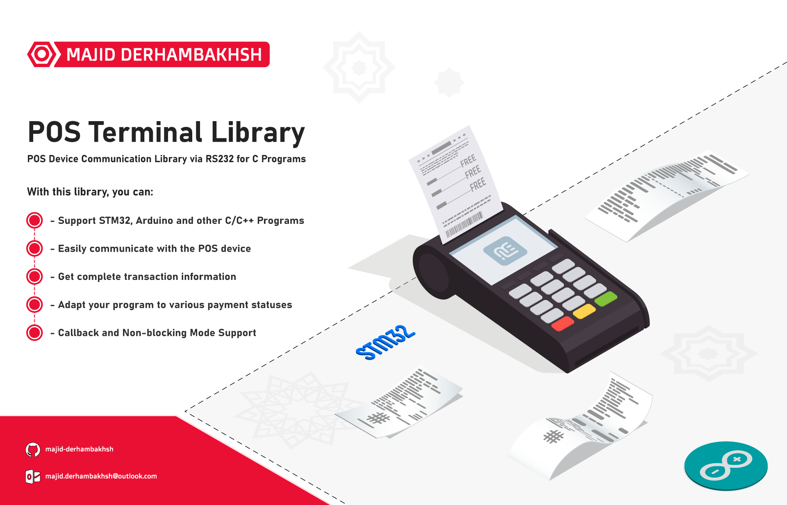

# POS Terminal Library
POS Device Communication Library via RS232 for STM32, other microcontrollers, and C programs

## Release
### Version: 1.0.0

- #### Type: Software/Embedded Software.

- #### Support :  
               - STM32 series  
               - Arduino
               - C/C++ Programs  

- #### Program Language: C

- #### Requirement Libraries: [HAL Driver for STM32] 
               
- #### Properties:
               - Support STM32, Arduino and other C/C++ Programs  
               - Easily communicate with the POS device
               - Get complete transaction information
               - Adapt your program to various payment statuses
               - Callback and Non-blocking Mode Support

- #### Changelog:
               -   

## Overview 
### Types:
- `enum POS_TransactionResultTypeDef`: Result of Transaction, Params:
  ```c++  
	- TRANSACTION_SUCCESS
	- TRANSACTION_CANCEL
	- TRANSACTION_WRONG_PASSWORD
	- TRANSACTION_POS_TIMEOUT
	- TRANSACTION_NETWORK_ERROR
	- TRANSACTION_INSUFFICIENT_FUNDS
	- TRANSACTION_TIMEOUT
	- TRANSACTION_WRONG_RESULT
	- TRANSACTION_PACKET_ERROR
  ```

- `enum POS_StatusTypeDef`: Status of POS Operation, Params:
  ```c++  
	- POS_ERROR
	- POS_OK
  ```

- `struct POS_TransactionInfoTypeDef`: Transaction Parameters, Params:
  ```c++  
	/* ...... Transaction Date ..... */
	uint16_t Year;
	uint8_t  Month;
	uint8_t  Day;
	
	/* ...... Transaction Time ..... */
	uint8_t  Hour;
	uint8_t  Minute;
	uint8_t  Second;
	
	/* ............................. */
	uint32_t Fee;
	
	char CardNumber[];
	char ReferenceNumber[];
	char TrackingNumber[];
	char MerchantID[];
	char TerminalID[];
  ```

- `struct POS_TypeDef`: POS Handle Type

### Macros:
```c++  
- None 
``` 

### Initialization and de-initialization functions:
```c++
- None 
```  

### Operation functions:
```c++  
/* ..................... POS - Transaction ..................... */
POS_StatusTypeDef POS_SendTransaction(POS_TypeDef *POS, char *TotalFee, uint32_t Timeout);

/* ..................... POS - ISR Handler ..................... */
void POS_UART_ISRHandler(POS_TypeDef *POS, uint8_t uData);
void POS_TimingHandler(POS_TypeDef *POS);

/* ...................... POS - Callback ....................... */
void POS_TransactionCallback(POS_TransactionResultTypeDef TransactionResult, POS_TransactionInfoTypeDef TransactionInfo);

``` 

## Guide

#### This library can be used as follows:
#### 1.  Add `pos_terminal.h` and `pos_terminal_conf.h` header
#### 2.  Add required headers in `pos_terminal_conf.h` header, for example:
  ```c++
#include "main.h"
#include "usart.h"
  ``` 
#### 3.  Define the `POS_TypeDef` object in global section of your C Code, for example:
  ```c++
POS_TypeDef MainPOS;
  ```
#### 4.  Add the `POS_UART_ISRHandler` function in UART Rx ISR, for example:
  ```c++
void UART_RxISR(uint8_t ReceivedValue)
{
	  POS_UART_ISRHandler(&MainPOS, ReceivedValue);
}
  ```
#### 5.  Add the `TransactionCallback` function in your C Code, for example:
  ```c++
void POS_TransactionCallback(POS_TransactionResultTypeDef TransactionResult, POS_TransactionInfoTypeDef TransactionInfo)
{
    // Some code to get transaction status and parameters
}
  ```
#### 6.  Add the `POS_TimingHandler` function in Loop or TimerISR, for example:     
  ```c++
int main()
{
    while (1)
    {
      POS_TimingHandler(&MainPOS);
    }
}
  ```
#### 7.  Start transaction with `POS_SendTransaction` function, for example:     
  ```c++
int main()
{
    while (1)
    {
      POS_SendTransaction(&MainPOS, Fee, 30000);
      POS_TimingHandler(&MainPOS);
    }
}
  ``` 
      
## Examples  
#### Example 1: Transaction via STM32
```c++  
#include "main.h"
#include "usart.h"
#include "gpio.h"

#include <stdio.h>
#include "pos_terminal.h"

/* ----------------- Global Variable ------------------- */
uint8_t uartData = 0;
char Fee[] = "50000";
char msg[300] = { 0 };

POS_TypeDef MainPOS;

/* ----------------- USART Interrupt ------------------- */
void HAL_UART_RxCpltCallback(UART_HandleTypeDef *huart)
{
	HAL_UART_Receive_IT(&huart2, &uartData, 1);
	POS_UART_ISRHandler(&MainPOS, uartData);
}

/* ------------------- POS Callback -------------------- */
void POS_TransactionCallback(POS_TransactionResultTypeDef TransactionResult, POS_TransactionInfoTypeDef TransactionInfo)
{
	
	switch (TransactionResult)
	{
		case TRANSACTION_SUCCESS:
		{
			sprintf(msg, "Transaction Success:\nFee:%lu\nDate:%d:%d:%d\nTime:%d:%d:%d\nCard Number:%s\nReference Number:%s\nTracking Number:%s\nTerminal:%s\n", TransactionInfo.Fee, TransactionInfo.Year, TransactionInfo.Month, TransactionInfo.Day, TransactionInfo.Hour, TransactionInfo.Minute, TransactionInfo.Second, TransactionInfo.CardNumber, TransactionInfo.ReferenceNumber, TransactionInfo.TrackingNumber, TransactionInfo.TerminalID);
			HAL_UART_Transmit(&huart1, (uint8_t*)msg, strlen(msg), 100);
		}
		break;

		case TRANSACTION_CANCEL:
		{
			HAL_UART_Transmit(&huart1, (uint8_t*)"Transaction Cancel\n", strlen("Transaction Cancel\n"), 100);
		}
		break;

		case TRANSACTION_WRONG_PASSWORD:
		{
			HAL_UART_Transmit(&huart1, (uint8_t*)"Wrong Password\n", strlen("Wrong Password\n"), 100);
		}
		break;

		case TRANSACTION_NETWORK_ERROR:
		{
			HAL_UART_Transmit(&huart1, (uint8_t*)"Network Error\n", strlen("Network Error\n"), 100);
		}
		break;
		
		case TRANSACTION_INSUFFICIENT_FUNDS:
		{
			HAL_UART_Transmit(&huart1, (uint8_t*)"Insufficient Funds\n", strlen("Insufficient Funds\n"), 100);
		}
		break;

		case TRANSACTION_POS_TIMEOUT:
		{
			HAL_UART_Transmit(&huart1, (uint8_t*)"POS Timeout\n", strlen("POS Timeout\n"), 100);
		}
		break;

		case TRANSACTION_TIMEOUT:
		{
			HAL_UART_Transmit(&huart1, (uint8_t*)"Transaction Timeout\n", strlen("Transaction Timeout\n"), 100);
		}
		break;

		case TRANSACTION_WRONG_RESULT:
		{
			HAL_UART_Transmit(&huart1, (uint8_t*)"Transaction Wrong Error\n", strlen("Transaction Wrong Error\n"), 100);
		}
		break;

		case TRANSACTION_PACKET_ERROR:
		{
			HAL_UART_Transmit(&huart1, (uint8_t*)"Packet Error\n", strlen("Packet Error\n"), 100);
		}
		break;
		
		default:
		break;
	}
	
}

/* ----------------------------------------------------- */
int main(void)
{
	/* Initialize SPI, GPIO, and requirement hardware */
	SystemClock_Config();
	MX_GPIO_Init();
	MX_USART1_UART_Init();
	MX_USART2_UART_Init();
  
	/* ---------------------------------------------- */
	MainPOS.UARTx = &huart2;

	HAL_UART_Receive_IT(&huart2, &data, 1);

	HAL_UART_Transmit(&huart1, (uint8_t *)"Hello, <Push Key to send transaction>\n", strlen("Hello, <Push Key to send transaction>\n"), 100);
	
	while (1)
	{
		if (HAL_GPIO_ReadPin(GPIOA, GPIO_PIN_0) == 0)
		{
			POS_SendTransaction(&MainPOS, Fee, 30000);
		}

		POS_TimingHandler(&MainPOS);
	}
}
```

## Test Performed:
- [x] STM32F1   
- [x] Arduino  
- [ ] AVR  

### Developer: Majid Derhambakhsh
